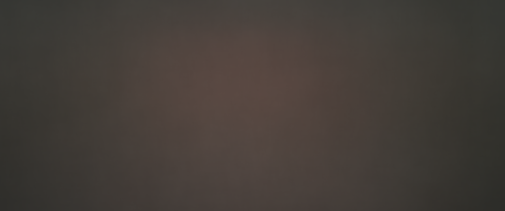

## Average Movie Images

Inspired by this [reddit thread](http://www.reddit.com/r/movies/comments/22fsve/wrote_a_script_to_average_each_frame_of_popular/), this script will take all images from a movie, grab each pixel RGB value, add them together then take the average and create a final image like this:

### Requirements

- [FFmpeg](http://www.ffmpeg.org/)
- [RMagick Gem](https://github.com/rmagick/rmagick)

### How-To

1. Generate frames from selected video using FFmpeg

	`ffmpeg -i input_file.mp4 -r 1 -f image2 images/images_%20d.png`
	
	Notes: `-r 1` Generates 1 frame per second. Modify to your liking.
	
2. Run the script `ruby images.rb`

3. Grab a beer. It's going to be a while.

4. Check out your newly generated final.png.

### Other Stuff

There's probably a better way to do all of this (like RMagick's [`average`](http://studio.imagemagick.org/RMagick/doc/ilist.html#average)) but I wanted to give it a shot. Any help making this script better would be appreciated!
